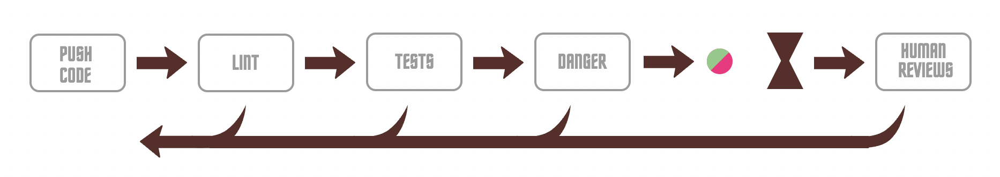
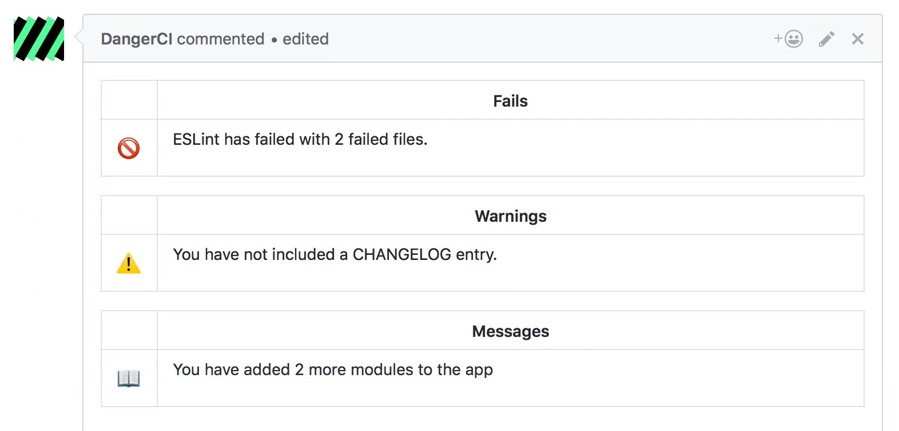
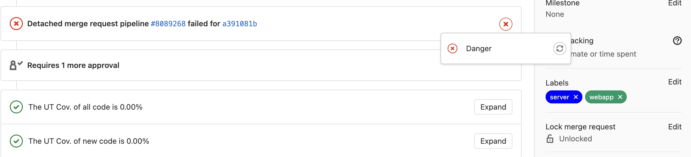
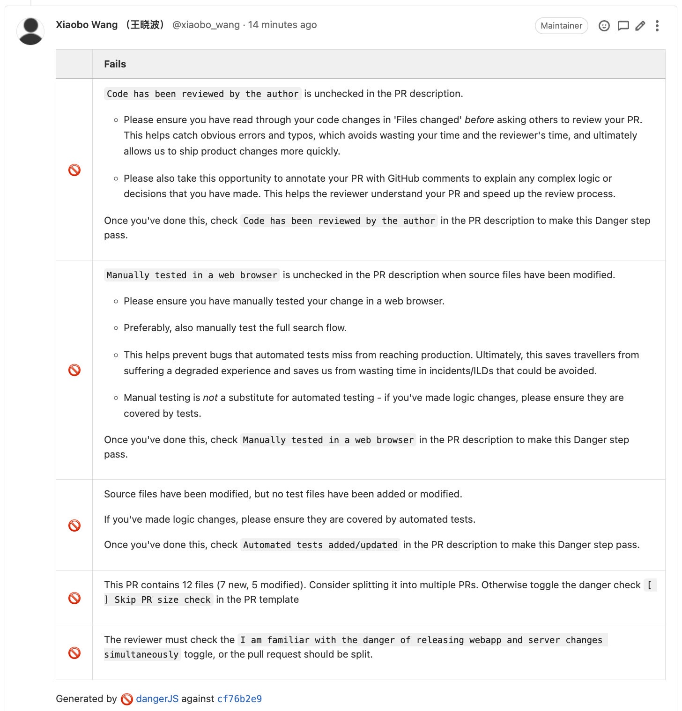

# Code review

<!-- markdown-toc GFM -->

- [关于 Code Review](#关于-code-review)
- [高效 CR 的建议](#高效-cr-的建议)
- [工具一：TripPal](#工具一trippal)
- [工具二：ChatGPT](#工具二chatgpt)
- [工具三：DangerJS](#工具三dangerjs)
  - [什么是 DangerJS](#什么是dangerjs)
  - [DangerJS 提供什么？](#dangerjs-提供什么)
  - [DangerJS 能做什么？](#dangerjs-能做什么)
  - [配置 DangerJS](#配置-dangerjs)
  - [最佳实践](#最佳实践)
  - [功能概括](#功能概括)

<!-- markdown-toc -->

## 关于 Code Review

Code Review（以下简称 CR） 即代码审核，目前主要存在于两个阶段：

1. 针对已经合并到主分支的代码，如对于组内所有成员在一周中提交的代码，来一次有组织的集体代码审核；
2. 针对即将合并到主分支的代码，也就是在 Merge Request（以下简称 MR）的时候进行代码审核。

目前我们仅针对第二种情况进行讨论，因为可以这么理解，在这个阶段，我们 MR 中的内容即将从纯粹的代码转变为产品，在这个阶段的审核既是对开发人员的负责，也是对用户的负责。

---

**_1. 优点_**

从 **Author** 的角度来看，通过 CR 可以：

- **找出潜在错误**。首先需要明确的是，任何功能代码提交的最低要求肯定是对于功能的实现，在合并代码之前如果有一个人可以认真审核自己的代码，无疑是一种对于功能实现正确性的背书。
- **增进代码质量**。实现同一个功能，不同的人可能有不同的设计思路，完全有可能别人存在一种更为高效、简洁的方案，如果他人可以在代码审核的时候提出，那么其实就是对于一个功能的多人参与实现，一定程度上提高了代码的质量。
- **互相学习**。我们完全可以从他人的评论，特别是建议或者意见中收获我们未曾触及的知识领域。被他人 Review 代码，也可以作为一种学习的途径。

从 **Reviewer** 的角度来看，也可以通过 CR 达到如下目的：

- **互相学习**。我们需要明确一点，任何人都可以参与 CR 中，任何人都可以作为 Reviewer，而学习是相互的。阅读他人的代码，不仅可以帮助他人提高代码质量，也完全可以从他人的代码中学习到一些成熟的、高效的开发经验。

最后就是 **Group** 的层面的一些收获：

- **形成开发规范**。
- **培养开发文化**。

---

**_2. 痛点_**

- **缺少时间**。不管是 Author 还是 Reviewer 都会遇到关于时间的问题。
  - **Reviewer** 自己也有工作任务需要完成，如何去挤出时间来帮助他人完成代码审核，就有点考验 Reviewer 的工作及时间安排上的能力了。
  - **Author** 本来就常常会花费大部分的时间完成功能的开发工作，而碰上紧急的需求又不可避免追求快速上线，这个时候就会希望自己的代码能够被快速审核,等待的过程就会显得格外漫长。
- **难以审核**。这个问题主要是 Reviewer 遇到的，审核他人的代码的过程其实就是理解他人的思想的过程，这个过程中会遇到很多障碍，导致不顺畅。
  - **MR 过大**。当一个 MR 中包含了海量的改动内容，那么审核人员一看到这个 MR 本能的就会产生抗拒心理。要知道审核代码的过程其实就是阅读他人思想的过程，了解别人的开发设计思路本身就相当花费精力。有限的精力碰上繁多的内容注定效率不高。
  - **不熟悉业务逻辑**。Reviewer 有时候会碰上之前从未接触的业务逻辑，这时候就会产生无从下手的感觉，从 0 开始往往是最难的，效率也是最低的。
  - **大量干扰内容**。如果审核内容中包含了很多和 MR 功能开发无关的改动内容，那么就会大大降低审核效率。干扰内容的来源主要有两个，一个是项目缺少统一的格式化配置，导致每个人按照自己的开发习惯对内容进行了格式化；另一个是改动内容和本次 MR 的目的无关，
  - **无从下手**。感觉有很多方面需要去考虑，但是又因为需要考虑的方面太多导致不知道从哪项开始。

---

**_3. 思考_**

我们可以将 CR 作为开发流程的必选项，但是这并不代表 CR 就能很好地被执行，因为 CR 的执行，很大程度上依赖于 Reviewer 的认真审查，以及 Author 的积极配合，两者是缺一不可的。

如果仅仅是当作一个制度去执行，那么有的是办法让 CR 看起来顺利执行。

CR 应该是一种开发文化，需要每个开发人员去切实认可，这种文化的培养没有那么容易，但是也没有那么难，我们可以参考几个方面：

- **认可**。CR 的重要性和必要性需要在团队内部达成共识,大家都认可后才会去想要认真执行，端正态度是一切的开始。
- **榜样**。榜样的力量是巨大的，它能提供给大家一个方向（要这么做及要怎么做），当大家都知道要这么做和要怎么做之后，惯性就会产生，习惯就会养成。
- **措施**。我们可以通过一些辅助手动，解决或者缓解 CR 过程中会遇到的痛点，让 CR 能够被顺利执行下去。
- **循序渐进**。虽然我们期望这能够让 CR 成为一种开发文化，但毕竟需要一个过程。

## 高效 CR 的建议

**_1. 心理安全_**

我们要相信不会根据代码审核的结果来衡量一个人的绩效，我们是通过 CR 来相互学习，减少可能存在的 bug，做更优质的产品。

每个人都可以积极参与到 CR 中，不管是作为 Author 还是 Reviewer。

---

**_2. 明确职责_**

CR 需要 Author 和 Reviewer 的积极配合才能被顺利执行下去，我们也需要明确这个过程中双方需要承担的职责。

作为 **Author** 有义务让 CR 变的顺利，所以可以从如下几个方面著手。

- **前置工作**，让额外干扰因素减少到最低：
  - Automated tests
  - Linting
  - Formatting
- **完善 MR 描述**。充分的背景描述和改动内容说明能够帮助 Reviewer 快速代入到需求中，帮助理解改动内容背后的设计思想。
- **控制 MR 大小**。建议 MR 中改动文件控制在 15 个左右，如果有必要可以考虑将 MR 进行拆分，同时标注 CR 顺序。
- **自我审核**。一个 MR 的第一审核人必须是 Author 本身，作为 Author 去对自己的代码进行审核主要是出于两点考虑：
  1. 减少低级错误
  2. 增加解释性描述
- **通知合适的人**。在 MR 创建后，我们可以将对应链接通知给指定的人，人员选择的优先顺序参考如下：
  1. 对于代码逻辑熟悉的人
  2. 对于项目逻辑精通的人
  3. 能找到的人
- **发起线下沟通**。当讨论的是一个有点复杂的问题时，及时考虑是否可以进行线下当面商议，同时将最终结果在线上标注。
- **积极主动推动**。当遇到 Reviewer 迟迟没有给出响应时，积极主动去推动 CR

作为 **Reviewer**，我们在代码审核过程中也许要注意几点：

- **对代码不对人**，整个 CR 都应该是针对代码的友好交流，虽然事实上存在找错的行为，但 Author 和 Reviewer 不是对立的。
- **遵循原则，而非个人观点**。Reviewer 需要明确，除了显而易见的错误之处，审核的标准应该是约定的原则，自己能够提供的是建议，更加不是阻塞这个 MR 进行的意见。
- **更进一步的解释**。专注于解释为什么错了，而不仅仅是哪里错了。
- **不要吝啬赞美**。对于认为不错的东西应该给予赞赏和鼓励。
- **及时反馈，避免阻塞**。
  1. 当暂时无法马上审核时，需要及时通知 Author 这一情况
  2. 当已经提供了一些评论时，需要及时通知 Author ，方便其知晓并做出下一步操作
  3. 当认可当前 MR 时，需要及时 Approve 并标注 LGTM(look good to me)并提醒 Author

---

**_3. 设定原则_**

- 技术事实和数据凌驾于观点和个人偏好之上
- 如果没有明确规则适用，Reviewer 会要求和当前代码库中内容保持一致，只要这不会使项目整体代码建康状况变化
- 如果没有明确的相关设计原则，那么在有说服力的证明（数据或可靠的工作原理）前提下，Reviewer 需要接受 Author 的偏好

---

**_4. Checklist_**

|  要点  |                                                                             审核内容                                                                             |
| :----: | :--------------------------------------------------------------------------------------------------------------------------------------------------------------: |
|  设计  |                                  CR 中最重要的是对功能逻辑的整体设计. 改动是否和其他部分很好集成?现在是添加此功能的最佳时机吗?                                   |
| 功能性 |                                                                边缘情况?功能演示?死锁?竞争?溢出?                                                                 |
| 复杂性 |                                 单行是否太复杂?函数是否太复杂?类是否太复杂?无法快速理解?其他人在开发或调试此代码是否会引入错误?                                  |
|  测试  |                                      除非是处理紧急情况,否则应将对应测试加入到当前 MR 中,确保测试是有效的.我们需要维护测试                                       |
|  命名  |                                   是否有意义?是否能够表明是什么及做什么?在长度和含义之间,含义永远是第一位的.风格参考规范或事实                                   |
|  评论  | 解释为什么存在,而不是解释代码做什么.如果代码不够清晰,不能自我解释,那么应该让代码变得简单. 让注释包含代码没有的内容. 如果有 TODO 等标记性注释,最好有对应的 Ticket |
|  风格  |                                                                          取决于项目配置                                                                          |
|  文档  |                         如果改动内容设计某个重要的设计逻辑,应该在对应的文档中修改对应的说明,如修改启动命令,则需要在 README.md 中同步更新                         |

总之 Reviewer 在进行代码审查时，您应该确保：

- 代码设计得很好。
- 该功能对代码的用户有好处。
- 任何 UI 更改都是合理的并且看起来不错。
- 任何并行编程都是安全完成的。
- 代码并不比它需要的更复杂。
- 开发人员没有实现他们将来可能需要的东西。
- 代码有适当的单元测试。
- 测试是精心设计的。
- 开发人员对所有内容都使用了清晰的名称。
- 评论清晰有用，主要解释为什么而不是什么。
- 代码已适当记录。
- 代码符合项目的风格指南。

确保每一行代码都被检查，确保正在改进代码健康度，称赞开发人员所做的好活。

---

**_5. 使用工具_**

- ESLint + Prettier
- TripPal
- DangerJS
- ChatGPT

## 工具一：TripPal

我们可以合理利用 TripPal 来让 CR 在消息传递方面变得更加顺畅：

- **创建单独的 CR 组**。每个人每天都会收到大量的消息，单纯依靠 GitLab 的消息推送很可能错过，我们可以通过创建专门的组来统一处理 CR 消息。
- **善于利用表情**。我们可以自定义表情，创建一些单独的有具体含义的表情来快速传达意思。
- **关注 GitLab 服务号**。我们的 TripPal 中有专门的 GitLab 服务号，当在 GitLab 上存在相关通知时会同步推送到 TripPal 中，方便及时了解信息。

## 工具二：ChatGPT

1. 添加 ChatGPT 到项目成员中
2. 在某个 Diff 区块下`@ChatGPT`帮助审核变更代码

## 工具三：DangerJS

### 什么是[DangerJS](https://danger.systems/js/)

DangerJS 运行在 CI 过程中，它能帮助团队自动执行一定的代码审查工作，主要针对的是那些日常的、机械的、重复的工作，让人们能够有精力去思考更难的问题。同时，我们也可以自定义规范，让 DangerJS 帮助我们执行检查。

| Danger Flow                                        |
| :------------------------------------------------- |
|  |

### DangerJS 提供什么？

DangerJS 向使用这提供两类工具，第一类是 log 工具，我们可以通过这些工具向 Merge Request 提交评论。

```javascript
import { fail, warn, message } from "danger";

fail("Eslint has failed with 2 failed files.");
warn("You have not included a CHANGELOG entry.");
message("You have added 2 more modules to the app.");
```

| What is DangerJS                                     |
| :--------------------------------------------------- |
|  |

这些方法唯一的区别在于输出内容前方的图标，唯一特殊的是我们在调用运行是添加参数 `--failOnErrors (-f)` 那么 Pipeline 会因为我们调用`fail`方法而导致失败。

第二类工具是一系列封装的信息，以平台为纬度进行区分，各平台提供信息的结构略有不同。

<details>
  <summary style="cursor: pointer; text-decoration:underline; color: #2AD;">相关信息</summary>

```javascript
import { danger } from "danger";

const {
  git: {
    created_files,
    modified_files,
    deleted_files,
    base,
    head,
    structuredDiffForFile,
    // ...
  },
  gitlab: {
    metadata: { pullRequestID },
    mr: {
      id,
      project_id,
      title,
      description,
      state,
      source_branch,
      target_branch,
      assignee,
      source_project_id,
      target_project_id,
      labels,
      // ...
    },
    commits,
    utils: {
      fileContents,
      addLabels,
      removeLabels,
      // ...
    },
  },
  github: {
    // ...
  },
  bitbucket_server: {
    // ..
  },
  bitbucket_cloud: {
    // ...
  },
} = getDanger();
```

</details>

### DangerJS 能做什么？

DangerJS 本身不会帮助我们实现检查，但是我们可以利用这些信息去分析校验，以检查 CHANGELOG 为例：

```javascript
// Add a CHANGELOG entry for app changes
const hasChangelog = danger.git.modified_files.includes("changelog.md");
const isTrivial = (danger.github.pr.body + danger.github.pr.title).includes(
  "#trivial"
);

if (!hasChangelog && !isTrivial) {
  warn("Please add a changelog entry for your changes.");
}
```

我们可以根据自己的需求去灵活自定义功能，当然也可以查询并使用现成的一些插件。配置使用后的效果如下：

| Danger Check Failed                                               |
| :---------------------------------------------------------------- |
|  |

| Failed Messages                                            |
| :--------------------------------------------------------- |
|  |

<details>
  <summary style="cursor: pointer; text-decoration:underline; color: #2AD;">支持平台</summary>

- AppCenter
- Bamboo
- BitbucketPipelines
- Bitrise
- BuddyBuild
- BuddyWorks
- Buildkite
- Circle
- Cirrus
- CodeBuild
- Codefresh
- Codemagic
- Codeship
- Concourse
- DockerCloud
- Drone
- GitHubActions
- GitLabCI
- Jenkins
- Netlify
- Nevercode
- Screwdriver
- Semaphore
- Surf
- TeamCity
- Travis
- VSTS

</details>

### 配置 DangerJS

> 以下配置均基于 GitLab

---

**_1. 在项目中引入 DangerJS_**

在项目中安装依赖

```bash
npm install -D danger
```

在项目根目录中创建`dangerfile.{js|ts}`文件，在其中写入想要让 DangerJS 帮助我们完成的检查任务。这里简单判断 MR 状态:

```javascript
import { danger, warn } from "danger";

if (danger.gitlab.mr.title.includes("Draft")) {
  warn("This is a draft MR");
}
```

最后，可通过 npm 命令向`package.json`中添加对应的命令

```bash
npm set-script 'ci:danger' 'npx danger ci -f -v'
```

我们可以通过 `npx danger help ci` 来查询对应命令的使用方法，在这里使用到了两个参数

- `-f` 为 `--failOnErrors`，使 DangerJS 在遇到`fail`输出信息是抛出错误，从而让 Pipeline 终止执行
- `-v` 为 `--verbose`，用于使 DangerJS 执行时同步输出日志信息，方便查阅

---

**_2. 评论账号_**

理论上任何账号都可以被用于提交 DangerJS 评论，但还是推荐使用一个专门的机器人账号来做这项工作。

登录评论账号，然后在个人设置创建一个名为`DANGER_GITLAB_API_TOKEN`的`Access Token`，在创建过程中需要设置过期时间及权限范围。

1. 过期时间：对于专门的机器人账号可以选择较长的时间。
2. 权限范围：由于需要读&写两种权限，所以选择`api`。

在创建`DANGER_GITLAB_API_TOKEN`完成后会显示对应的 token 值，务必将这个 token 值记录下来备用，因为只会显示一次！！！

---

**_3. 项目设置_**

在项目中安装好 DangerJS 及准备好评论账号后，我们还需要将 DangerJS 配置进 Pipeline 中：

1. 添加机器人评论账号到项目成员中，具体路径为 `Members` > `Invite member`，可以选择 `Developer` 角色
2. 设置 Gitlab 环境变量，具体路径为 `Settings` > `CI/CD` > `Variables`中，添加的变量如下：

- 变量名为`DANGER_GITLAB_API_TOKEN`，值为刚才创建的机器人账号的 Access Token - `DANGER_GITLAB_API_TOKEN`
- 变量名为`DANGER_GITLAB_HOST`，值为`http://git.dev.sh.ctripcorp.com`，对应公司 Gitlab 的 host

3. 配置 CI。

---

**_4. CI 设置_**

推荐在`VerifyAndBuild`前添加一个`Check`的阶段，以我们项目为例的 Danger 任务配置如下：

```yaml
Danger:
  stage: Check
  image: hub.cloud.ctripcorp.com/nfesres/nfes_base:nfes5_16.V2
  tags:
    - official-uat
  cache:
    key: $CI_COMMIT_REF_SLUG-$CI_COMMIT_SHORT_SHA
    paths:
      - node_modules
      - scripts
    policy: pull
  script:
    - npm run ci:danger
  only:
    - merge_requests
```

至此项目的配置基本完成，可以通过创建一个 MR 来测试效果。

---

**_5. 本地调用_**

如果想要在本地调试`dangerfile.{js|ts}`文件，可以通过 danger 提供的本地调试功能完成。具体操作如下：

1. 在命令行中设置本地环境变量

- `export DANGER_GITLAB_API_TOKEN={机器人账号AccessToken}`
- `export DANGER_GITLAB_HOST=http://git.dev.sh.ctripcorp.com`

2. 准备好 Merge Request URL，如`http://git.dev.sh.ctripcorp.com/FlightMobile/aws-lighthouse-site/-/merge_requests/252`
3. 在命令行中运行 `npx danger pr {MergeRequestURL}`

### 最佳实践

将 MR Template 和 Dangerfile 相互配合，实现一系列自动化检测的功能。

<details>
  <summary style="cursor: pointer; text-decoration:underline; color: #2AD;">MR Template</summary>

```markdown
# Ticket

# Why has this change been made?

# What changed?

- changes

# Screenshot

  

## For all changes

- [ ] Code has been reviewed by the author
- [ ] Manually tested in a web browser
- [ ] Automated tests added/updated

## For UI changes

- [ ] Manually tested on a real mobile device
- [ ] Manually tested in other browsers (which ones?)
- [ ] Manually tested RTL support (with screenshot)
- [ ] Manually tested accessibility in main browsers: Chrome, Firefox and Safari

# Danger toggles

- [ ] Skip MR size check
- [ ] I am familiar with the danger of releasing webapp and server changes simultaneously. I agree that the changes here are backwards compatible and that this MR does not need to be split.
```

</details>

<details>
  <summary style="cursor: pointer; text-decoration:underline; color: #2AD;">Dangerfile</summary>

```javascript
import { danger } from "danger";
const {
  commonMrDescription,
  mrDescription,
  inCommitGrep,
} = require("./danger/tools");
const {
  git: { created_files: createdFiles, modified_files: modifiedFiles },
  gitlab: {
    utils: { addLabels },
  },
} = danger;

const fileChanges = [...modifiedFiles, ...createdFiles];

/**
 * Check there is a description for internal or external contributions
 */
commonMrDescription({
  minLength: 50,
  logType: "message",
  msg: "Please provide more context about your MR that other engineers, or your future self, would find useful.",
});

/**
 * Hard fail if MR author has not reviewed their code
 */
const MR_SELF_REVIEW_CHECK = "Code has been reviewed by the author";
const hasMrAuthorSelfReviewed = mrDescription.includes(
  `[x] ${MR_SELF_REVIEW_CHECK}`
);
if (!hasMrAuthorSelfReviewed) {
  fail(
    `\`${MR_SELF_REVIEW_CHECK}\` is unchecked in the MR description.\n\n` +
      "* Please ensure you have read through your code changes in 'Files changed' _before_ asking others to review your MR. " +
      "This helps catch obvious errors and typos, which avoids wasting your time and the reviewer's time, and ultimately allows us to " +
      "ship product changes more quickly.\n\n* Please also take this opportunity to annotate your MR with GitHub comments to explain " +
      "any complex logic or decisions that you have made. This helps the reviewer understand your MR and speed up the review process.\n\n" +
      `Once you've done this, check \`${MR_SELF_REVIEW_CHECK}\` in the MR description to make this Danger step pass.`
  );
}

/**
 * Hard fail if PR author has not manually tested their changes when source files have been modified
 */
const MANUAL_TEST_CHECK = "Manually tested in a web browser";
const hasBeenManuallyTested = mrDescription.includes(
  `[x] ${MANUAL_TEST_CHECK}`
);
const hasSourceFileChanges = inCommitGrep(
  /packages\/(client|server)\/.*.(?<!test.)(js|ts|jsx|tsx)$/
);
if (hasSourceFileChanges && !hasBeenManuallyTested) {
  fail(
    `\`${MANUAL_TEST_CHECK}\` is unchecked in the PR description when source files have been modified.\n\n` +
      "* Please ensure you have manually tested your change in a web browser.\n\n* Preferably, also manually test the full search flow.\n\n" +
      "* This helps prevent bugs that automated tests miss from reaching production. Ultimately, this saves travellers from " +
      "suffering a degraded experience and saves us from wasting time in incidents/ILDs that could be avoided.\n\n" +
      "* Manual testing is _not_ a substitute for automated testing - if you've made logic changes, please ensure they are covered by tests.\n\n" +
      `Once you've done this, check \`${MANUAL_TEST_CHECK}\` in the PR description to make this Danger step pass.`
  );
}

/**
 * Hard fail if source files have been modified, but not test files
 */
const AUTOMATED_TEST_CHECK = "Automated tests added/updated";
const hasUpdatedAutomatedTests = mrDescription.includes(
  `[x] ${AUTOMATED_TEST_CHECK}`
);
const hasTestFileChanges = inCommitGrep(
  /packages\/(client|server)\/.*test.*(js|ts|jsx|tsx)$/
);
if (hasSourceFileChanges && !hasTestFileChanges && !hasUpdatedAutomatedTests) {
  fail(
    "Source files have been modified, but no test files have been added or modified.\n\n" +
      "If you've made logic changes, please ensure they are covered by automated tests.\n\n" +
      `Once you've done this, check \`${AUTOMATED_TEST_CHECK}\` in the PR description to make this Danger step pass.`
  );
}

/**
 * Encourage smaller PRs.
 */
const SKIP_BIG_PR_FAIL_CHECK = "Skip PR size check";
const SKIP_BIG_PR_FAIL = mrDescription.includes(
  `[x] ${SKIP_BIG_PR_FAIL_CHECK}`
);
const bigPRThreshold = 10;
if (!SKIP_BIG_PR_FAIL && fileChanges.length > bigPRThreshold) {
  fail(
    `This PR contains ${fileChanges.length} files (${createdFiles.length} new, ${modifiedFiles.length} modified). Consider splitting it into multiple PRs. Otherwise toggle the danger check \`[ ] Skip PR size check\` in the PR template`
  );
}

/**
 * Labelled PRs.
 */
const PR_LABELS = [
  {
    match: inCommitGrep(/packages\/server\/(?!app\/tests\/).*/),
    name: "server",
  },
  {
    match: inCommitGrep(/packages\/client\/.*/),
    name: "webapp",
  },
];

PR_LABELS.forEach(({ match, name }) => {
  if (match) {
    addLabels(name);
  }
});

const SKIP_SERVER_CLIENT_FAIL_CHECK_REVIEWER =
  "I am familiar with the danger of releasing webapp and server changes simultaneously";

const SKIP_SERVER_CLIENT_REVIEWER_FAIL = mrDescription.includes(
  `[x] ${SKIP_SERVER_CLIENT_FAIL_CHECK_REVIEWER}`
);

/**
 * Check if changes have been made to both the server and client code
 */
if (
  inCommitGrep(/packages\/client\/.*/) &&
  inCommitGrep(/packages\/server\/(?!app\/tests\/).*/)
) {
  if (!SKIP_SERVER_CLIENT_REVIEWER_FAIL) {
    fail(
      `The reviewer must check the \`${SKIP_SERVER_CLIENT_FAIL_CHECK_REVIEWER}\` toggle, or the pull request should be split.`
    );
  } else {
    warn(
      "Please be extra careful when making changes to code in both the webapp and server code.\n" +
        "Any API changes need to be deployed ahead of client changes as not all instances will be instantly updated."
    );
  }
}
```

</details>

### 功能概括

- 分析 MR 相关信息并做一些针对性的操作
- 分析本地代码及数据，如 test coverage、lighthouse report、bundle size
